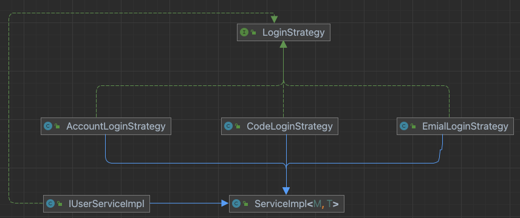

## 本项目作为springboot项目
>>主要针对设计模式进行开发，并熟练运用，优雅完成项目中的代码，涉及常用的中间件、常用的开发功能，以及常用的涉及模式

- 登陆模块
    考虑登陆方式的多样性，采用策略模式进行设计，登陆方式有：手机号(手机号和验证码)、账号密码、邮箱密码，后续将考虑扫码登陆
  ~~~java
  public interface LoginStrategy {
    R login(LoginDTO loginDTO, HttpSession session);
  }
  ~~~
  
- 