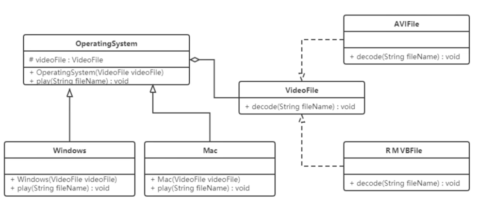
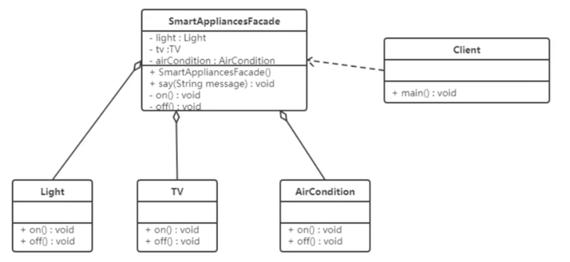
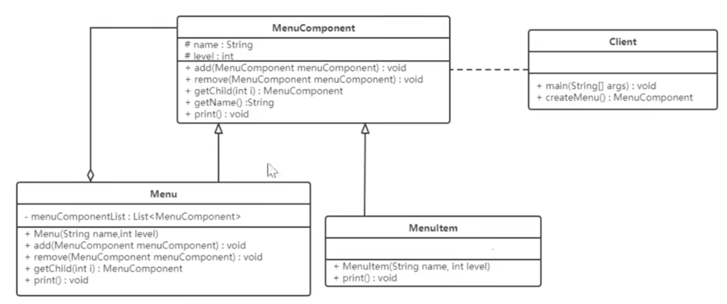
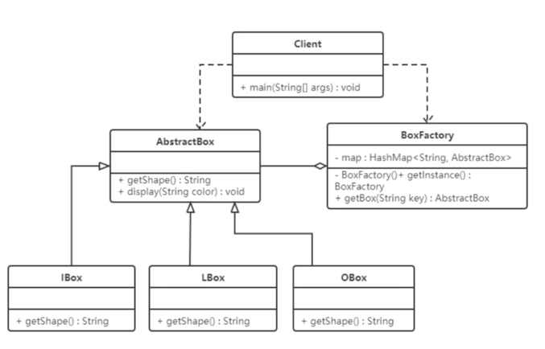
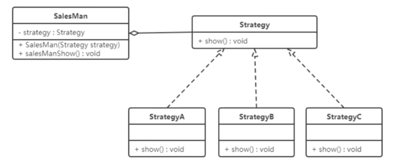

## 设计模式

### 桥接(bridge)模式
- 开发跨平台的视频播放器，可以在不同操作系统(Mac, Windows, Linux)播放不同编码(avi, mp4...)的视频文件;
  
- 好处：
  - 提高系统可扩展性，在两个变化维度中任意扩展一个维度，不需要修改原有系统
  - 实现细节对客户透明
- 使用场景
  - 一个类存在两个独立变化的维度，且两个维度都需要进行扩展时
  - 一个系统不希望使用继承或因为多层次继承导致系统类的个数急剧增加
  - 一个系统需要在构建的抽象话角色和具体化角色之间增加更多的灵活性时，避免在两个层次之间建立静态的继承联系，通过桥接模式可以使它们在抽象层建立一个关联关系
    
### 外观(facade)模式
- 通过为多个复杂的子系统提供一个一致的接口，而使这些子系统更加容易被访问的模式。这种模式对外有一个统一接口，外部程序不用关心内部子类的具体实现细节，大大降低应用程序复杂度提高可维护性;
- 结构
 - 外观角色：为多个子系统提供接口
 - 子系统角色：实现系统功能

 
- 定义一个SmartAppliancesFacade来帮助人们进行开关灯、电视机、空调等。
- 好处
  - 降低子系统与客户之间耦合度，使得子系统的变化不会影响调用它的客户类
  - 对客户屏蔽了子系统组件，减少了客户处理的对象数目，并使得子系统使用起来更加容易。
- 缺点
  - 不符合开闭原则，修改麻烦。
- 使用场景
  - 对分层系统构建，简化每层入口点和子系统之间的依赖关系
  - 子系统复杂时，设计一个简单的接口供外界访问
  - 客户端与多个子系统存在很大联系时，外观模式将它们分离，提高子系统的独立性和可移植性。

### 组合(combination)模式
- 部分-整体模式，把一组相似对象当作单一对象，依据树形结构来组合对象，表示部分以及整体模式；
- 结构
  - 抽象根节点：各层次对象的共有方法和属性，如每一个文件夹下面有好多文件，文件夹就是抽象根节点；
  - 树枝节点：文件夹存储文件，树形结构中间的一些文件夹
 - 子节点：具体文件，不能再分。

- 优点
  - 清楚定义分层次的复杂对象，方便对整个层次结构进行控制
  - 客户端可以一致使用一个组合结构或其中单个对象，不必关心处理的是单个还是整个组合结构，简化客户端代码
  - 增加树枝节点、叶子节点方便，“开闭原则”；
  - 为树形结构的面向对象实现提供一种灵活的解决方案，通过叶子节点和树枝节点的递归组合，可以形成复杂的树形结构。
- 使用场景
  - 出现在树形结构的地方，文件目录显示、多级目录呈现等树形结构的数据操作
- 分类
   - 透明组合模式：抽象根节点声明所有用于管理成员对象的方法，确保所有构件类都有相同的接口
   - 缺点：不够安全。
   - 安全组合模式：抽象根节点没有声明任何用于管理成员对象的方法，而是在树枝节点**Menu**类中声明并实现这些方法
   - 缺点：不够透明。

### 享元(Flyweight)模式
- 共享技术有效支持大量细粒度对象的复用，通过共享已经存在的对象来大幅度减少要创建的对象数量，避免大量相似对象的开销，从而提高系统资源的利用率。
- 状态
  - 内部状态：不随着环境改变而改变的共享部分
  - 外部状态：随环境改变而改变的不可以共享的部分，享元模式实现要领就是区分这两种状态，并将外部状态外部化。
- 角色
  - 抽象享元模式：接口抽象类，声明具体享元类公共的方法，这些方法可以向外界提供享元对象的内部数据，同时设置外部数据
  - 具体享元：实现抽象享元类，称为享元对象，在具体享元类中为内部状态提供类存储空间；
  - 非享元：并不是所有的享元类的子类都需要被共享，不能被共享的子类可设计为非共享具体享元类
  - 享元工厂：负责创建和管理享元角色。当客户请求一个享元对象时，享元工厂检查系统中是否存在符合要求的享元对象，如果存在则提供给客户，不存在则创建一个新的享元对象。

- 优点
  - 减少内存中相似或相同对象，节约系统资源，提供系统性能
  - 享元模式外部状态相对独立，且不影响内部状态
- 缺点
  - 为了使对象可以共享，需要将享元对象的部分状态外部化，分离内部状态和外部状态，使程序逻辑复杂
- 使用场景
  - 一个系统有大量相同或相似对象，造成资源浪费
  - 对象大部分都可以外部化，可以将这些外部状态传入对象中
  - 需要多次重复使用享元对象，有个存享元对象的池

## 行为行模式

### 模版方法模式
- 设计系统知道算法关键步骤，确定步骤执行顺序，但某些步骤具体实现还未知，或者某些步骤实现与具体环境相关；
- 结构
  - 抽象类：负责给算法的轮廓和骨架，由一个模版方法和若干个基本方法构成
  - 基本方法：实现算法步骤的方法，是模版方法的组成部分，由其具体子类实现
    - 抽象方法：一个抽象方法由抽象类声明，由具体子类实现
    - 具体方法：一个具体方法由一个抽象类或具体类声明并实现，其子类可以进行覆盖也可以直接继承
    - 钩子方法：在抽象类中已经实现，包括用于判断的逻辑方法和需要子类重写的空方法两种，一般钩子方法是用于判断的逻辑方法，这类方法名一般为isXxx，返回值为boolean类型
  - 具体子类：实现抽象类中所定义的抽象方法和钩子方法，它们是一个顶级逻辑的组成步骤； 

- 优点
  - 提高代码复用性，将相同的代码放在抽象的父类中，而将不同代码放入不同的子类中
  - 实现了反向控制，通过一个父类调用其子类实现，通过对子类的具体实现扩展不同的行为，实现了反向控制，符合“开闭原则”
- 缺点
  - 对每个不同对实现都需要定义一个子类，导致类个数增加，系统更加庞大
  - 父类中的抽象方法由子类实现，子类执行的结果会影响父类的结果，导致一种反向的控制结构，提高代码阅读难度
- 使用场景
  - 算法整体步骤稳定，其中个别部分易变时，将容易变化的抽象出来，供子类实现
  - 需要通过子类来决定某个步骤是否执行，实现子类对父类的反向控制

### 策略模式
- 定义一系列算法，将算法封装，是他们相互替换，算法变化不影响使用算法的客户，属于对象行为模式
- 结构
   - 抽象策略类：抽象角色，通常由一个接口或抽象类实现，给出所有的具体策略类所需的接口
   - 具体策略：实现抽象策略定义的接口，提供具体的算法实现或行为
   - 环境类：持有一个策略类的引用，最终给客户端调用

- 优点
   - 策略类之间可以自由切换
   - 易于扩展
   - 避免使用多重条件选择语句(if...else)，体现面向对象
- 缺点
   - 客户端必须知道所有的策略类，并自行决定使用哪一个策略类
   - 策略模式将造成产生很多策略类，可以通过使用享元模式在一定程度上减少对象的数量
- 使用场景
   - 一个系统需要动态在几种算法选择一种时， 可将每个算法封装到策略类中
   - 一个类定义多种行为，并且这些行为在这个类的操作中以多个条件语句出现，每个条件分支移入各自策略中
   - 系统中各种算法彼此完全独立，且要求对客户隐藏具体算法的实现细节
   - 系统要求使用算法的客户不应该知道操作的数据时，可使用策略模式隐藏与算法相关的数据结构
   - 多个类只区别在表现行为不同 

-
 
